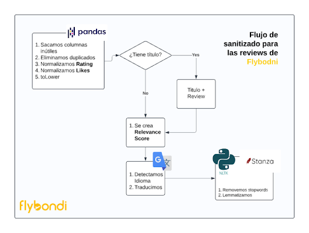

# Flybondi Reviews

Taking a deep dive and understanding the strengths and weaknesses of the business based on online reviews.

### Data Cleaning Pipeline for Flybondi Reviews

This cleaning pipeline processes the Flybondi reviews to prepare the data for analysis. The image below show a preview of the data recollection process.

#### Steps

1. **Initial Cleaning with Pandas**  
   - Drop unnecessary columns.
   - Remove duplicate entries.
   - Normalize columns like `Rating` and `Likes`.
   - Convert text to lowercase for consistency.

2. **Review Content Check**  
   - Verify if each review has a title. If so, concatenate the title with the review content.

3. **Relevance Scoring**  
   - For reviews without a title, generate a `Relevance Score` to prioritize them in the analysis.

4. **Language Detection and Translation**  
   - Detect the language of each review.
   - Translate non-Spanish reviews to Spanish using Google Translate API for uniform language analysis.

5. **Text Processing with NLP Libraries**  
   - Use Stanza and NLTK to clean the review text further:
     - Remove stopwords.
     - Lemmatize words to their root form for better NLP processing.

This pipeline ensures the reviews are cleaned, normalized, and ready for further sentiment analysis or business insights extraction.

### Processing and Analysis of Flybondi Reviews

This section outlines the processing and analysis steps applied to Flybondi reviews to extract valuable insights and predict review ratings. The pipeline consists of several stages, from topic modeling to sentiment analysis and predictive modeling.

#### Analysis

1. **Latent Dirichlet Allocation (LDA) for Topic Modeling**  
   - **Objective**: Identify major themes within customer reviews to gain insights into common feedback topics (e.g., customer service, flight delays).
   - **Method**: LDA is used to discover latent topics within the reviews, which helps categorize the feedback into meaningful themes.

2. **Sentiment Analysis with mBERT**  
   - **Objective**: Analyze sentiment in multilingual reviews to gauge overall customer satisfaction.
   - **Method**: The multilingual BERT (mBERT) model is applied to reviews in various languages, offering a consistent approach to sentiment scoring across different linguistic contexts. This step helps Flybondi understand customer sentiment regardless of the review's original language.

3. **Flight Stages with Relevance Analysis**  
   - **Objective**: Emphasize the most impactful flight stages  to understand the weak areas that could be improved.
   - **Method**: We sepparate common words for flight stages and analyze the sentiment around these to understand which fligh stages should be worked upon.

4. **Predictive Analysis with RNN and LSTM**  
   - **Objective**: Predict the review `rating` from the text content, providing Flybondi with a predictive model that can be used on unstructured feedback from different channels.
   - **Method**: An RNN with Long Short-Term Memory (LSTM) is trained on the review content:
     - **Architecture**: The model includes an embedding layer, an LSTM layer to capture text sequence dependencies, and a dense output layer for rating prediction.
     - **Evaluation Metrics**: The model’s performance is assessed using Mean Absolute Error (MAE), Mean Squared Error (MSE), and R² Score.

5. **Weighted Training with Relevance Score**  
   - **Objective**: Improve the predictive model by focusing on high-impact reviews.
   - **Method**: The `Relevance Score` is used as sample weights during training, giving priority to more impactful reviews, enhancing the model's focus on the most relevant feedback.

#### Summary

This analysis pipeline offers Flybondi a comprehensive approach to understanding customer feedback through:
- Topic detection with LDA to identify review themes.
- Sentiment analysis using mBERT for multilingual consistency.
- Predictive modeling of review ratings with RNN-LSTM, weighted by relevance to prioritize significant reviews.

These insights support Flybondi in making data-driven decisions to improve customer experience and service quality.